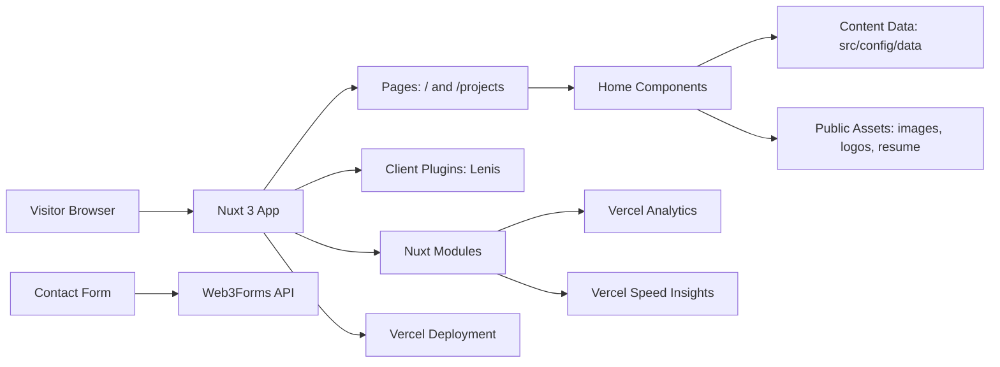
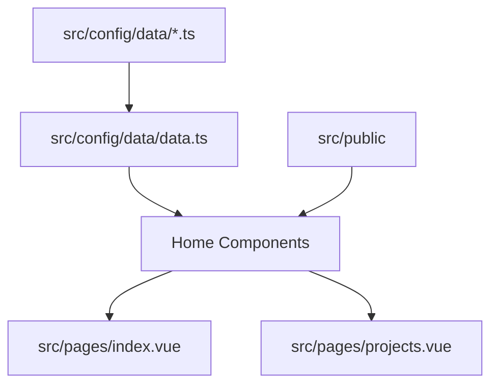
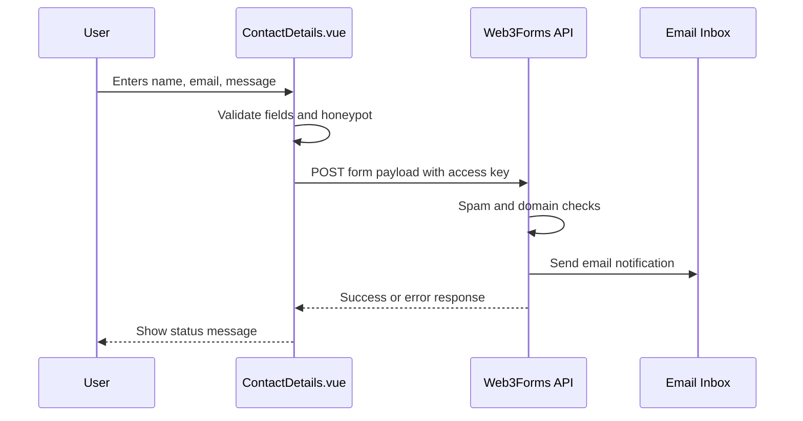
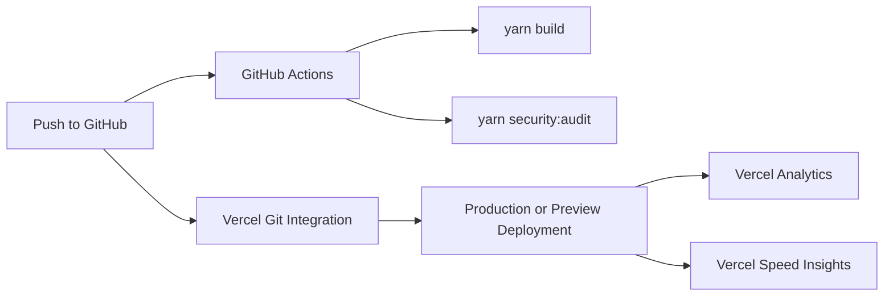

# Tanvir Rahman Portfolio

A Nuxt 3 portfolio site for presenting projects, experience, skills, education, contact details, and downloadable resume content. The app is built as a client-rendered Nuxt application with prerendered public routes, animated UI sections, Vercel Analytics, Vercel Speed Insights, Web3Forms contact handling, and security-focused deployment defaults.

## Table Of Contents

- [Features](#features)
- [Tech Stack](#tech-stack)
- [Architecture](#architecture)
- [Project Structure](#project-structure)
- [Data Flow](#data-flow)
- [Security](#security)
- [Getting Started](#getting-started)
- [Environment Variables](#environment-variables)
- [Available Scripts](#available-scripts)
- [Deployment](#deployment)
- [Maintenance](#maintenance)

## Features

- Personal landing page with hero, skills, experience, project, and contact sections.
- Dedicated `/projects` route for extended project listings.
- Data-driven content from `src/config/data`.
- Smooth scrolling via Lenis and scroll-triggered animations via GSAP.
- Responsive UI with Tailwind CSS, SCSS, Nuxt Icon, and device-aware rendering.
- Contact form powered by Web3Forms with client validation and honeypot spam protection.
- Vercel Analytics and Speed Insights enabled through Nuxt modules.
- Security headers, CSP report-only policy, safe external links, CI audit, Dependabot, Gitleaks, and `security.txt`.

## Tech Stack

| Area | Technology |
| --- | --- |
| Framework | Nuxt 3, Vue 3 |
| Styling | Tailwind CSS, SCSS |
| Animation | GSAP, Lenis, tsparticles via `nuxt-particles` |
| State | Pinia |
| Icons | Nuxt Icon |
| Forms | Web3Forms |
| Analytics | Vercel Analytics, Vercel Speed Insights |
| Package Manager | Yarn 1 |
| CI/Security | GitHub Actions, Dependabot, Gitleaks, Yarn audit |

## Architecture



## Project Structure

```text
.
├── config/                  # Shared Nuxt/Vite configuration fragments
├── src/
│   ├── assets/              # Tailwind and SCSS styles
│   ├── components/          # Reusable Vue components and home sections
│   ├── composables/         # SEO, scroll, and responsive helpers
│   ├── config/              # Navigation, helpers, and portfolio data
│   ├── layouts/             # Nuxt layouts
│   ├── pages/               # Nuxt routes
│   ├── plugins/             # Client plugins
│   ├── public/              # Static assets served from site root
│   └── stores/              # Pinia stores
├── .github/                 # CI and Dependabot automation
├── nuxt.config.ts           # Main Nuxt config, modules, route rules, headers
├── package.json             # Scripts and dependencies
└── yarn.lock                # Dependency lockfile
```

## Data Flow

Most visible content is driven from local TypeScript data files. This keeps UI components focused on presentation while making copy, skills, projects, and experience easier to update.



### Contact Form Flow



## Security

Security measures currently implemented:

- Global security headers in `nuxt.config.ts`.
- CSP in report-only mode to observe violations before enforcing.
- `X-Frame-Options`, HSTS, referrer policy, permissions policy, content sniffing protection, and cross-origin policies.
- `target="_blank"` links use `rel="noopener noreferrer"`.
- Contact form validation, honeypot field, and no debug logging.
- Web3Forms access key treated as a public form access key, following Web3Forms guidance.
- `.env.example` contains placeholders only.
- GitHub Actions runs build and dependency audit.
- Gitleaks scans for accidental secrets.
- Dependabot checks npm and GitHub Actions dependencies.
- Public vulnerability contact file at `/.well-known/security.txt`.

> Note: Web3Forms recommends using its access key client-side rather than proxying submissions through a server endpoint. If domain restrictions are enabled in Web3Forms, allow the production domain and local development hosts as needed.

## Getting Started

### Prerequisites

- Node.js 22 recommended, matching CI.
- Yarn 1, matching `packageManager` in `package.json`.

### Install

```bash
yarn install
```

### Configure Environment

Create a local `.env` file from the example:

```bash
cp .env.example .env
```

Then set your Web3Forms access key:

```env
NUXT_PUBLIC_WEB3FORMS_ACCESS_KEY=your-web3forms-access-key
```

### Run Development Server

```bash
yarn dev
```

The app runs at:

```text
http://localhost:3000
```

## Environment Variables

| Variable | Required | Description |
| --- | --- | --- |
| `NUXT_PUBLIC_WEB3FORMS_ACCESS_KEY` | Yes for contact form | Public Web3Forms access key used by the contact form. |
| `NUXT_ENV` | Optional | Environment label used by local config. |
| `NUXT_APP_NAME` | Optional | App name used by PM2 ecosystem config. |
| `NUXT_APP_PORT` | Optional | App port used by PM2 ecosystem config. |
| `NUXT_APP_DEBUG` | Optional | Local debug flag placeholder. |

## Available Scripts

```bash
yarn dev
```

Start the Nuxt development server.

```bash
yarn build
```

Build the production application.

```bash
yarn generate
```

Generate static output where applicable.

```bash
yarn preview
```

Preview a production build locally.

```bash
yarn security:audit
```

Run a moderate-or-higher dependency vulnerability audit.

## Deployment

This project is designed for Vercel.



Deployment checklist:

- Add `NUXT_PUBLIC_WEB3FORMS_ACCESS_KEY` to Vercel Environment Variables.
- Enable Vercel Analytics and Speed Insights in the Vercel dashboard.
- Keep `yarn.lock` as the source of truth for installs.
- Keep preview deployment protection enabled if public previews are not needed.

## Maintenance

- Update portfolio content in `src/config/data`.
- Add public files and images under `src/public`.
- Keep dependencies current through Dependabot PRs.
- Review CSP reports before changing `Content-Security-Policy-Report-Only` to enforced `Content-Security-Policy`.
- Rotate the Web3Forms access key if it is abused or if domain restrictions are changed.
